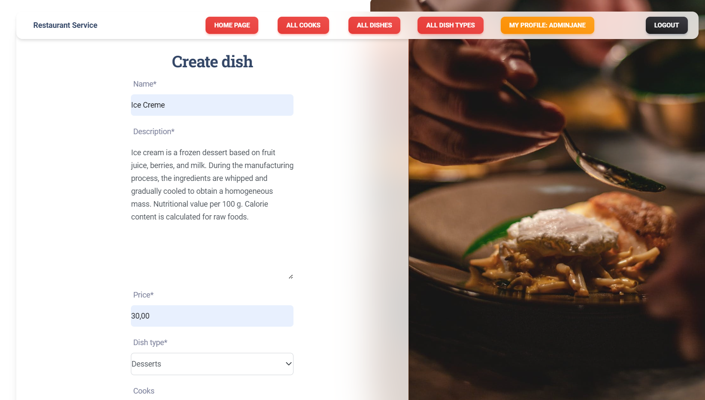
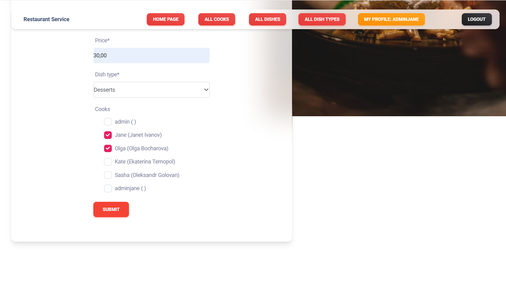
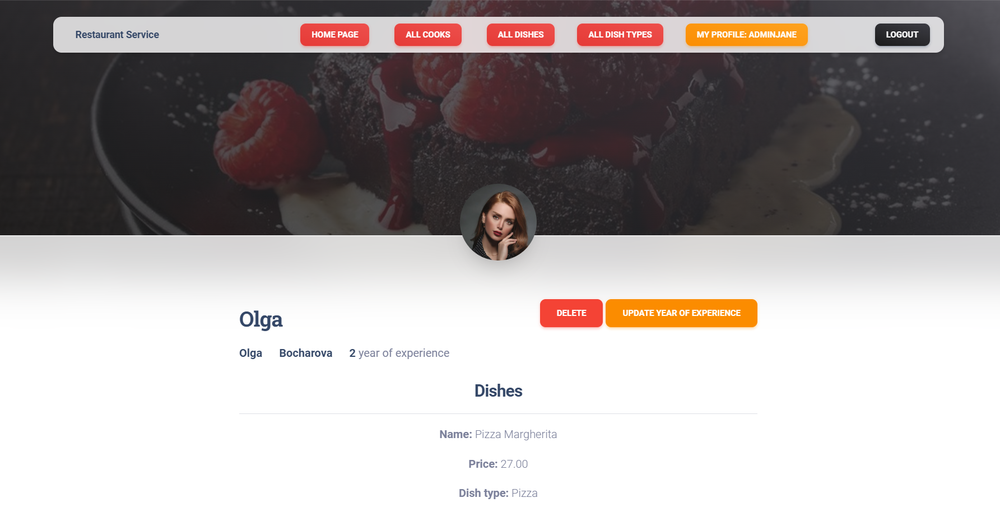
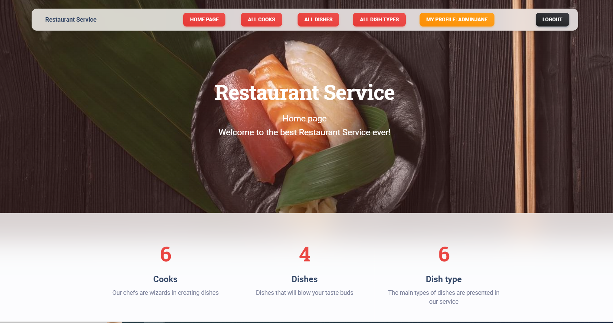
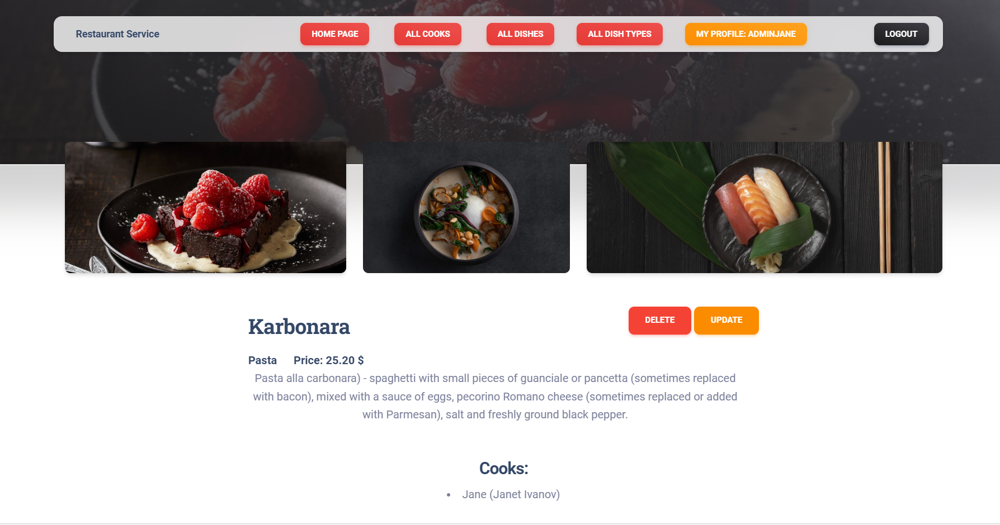

# Restaurant Kitchen Service
> Where Culinary Creativity Meets Seamless Collaboration

Restaurant Kitchen Service is a comprehensive management system designed to enhance communication and streamline operational processes within a restaurant kitchen. As the owner, you aim to create an efficient platform where cooks can collaboratively manage and organize the creation of new dishes and dish types. This system empowers cooks to contribute to the culinary offerings of the restaurant by adding innovative dishes to the menu.
## Check it out

[Restaurant project deployed to Render](https://restaurant-kitchen-service-3nxi.onrender.com)


## Installation
Follow these steps to set up the project locally:


Clone the repository and switch to the project directory:
```shell
git clone https://github.com/Evheniia96/restaurant-kitchen-service.git
cd restaurant-kitchen-service
```

Create a virtual environment:
```shell
python -m venv venv
```

Activate the virtual environment:
On Windows:
```shell
 venv\Scripts\activate
 ```
On macOS and Linux:
```shell
source venv/bin/activate
```

Install dependencies:
```shell
pip install -r requirements.txt
```
Run:
```shell
python manage.py runserver
```


## Key Features:

* Dish Creation:



Cooks can easily create new dishes, providing detailed information such as name, ingredients, and preparation instructions.
The system allows for the classification of dishes into various types (Dishtypes), providing a structured organization of the menu.

* Responsibility Assignment:


Cooks can assign specific dishes to themselves or fellow team members, clearly defining responsibilities for each item on the menu.
This feature ensures accountability and a streamlined workflow by assigning cooks to dishes based on their expertise and availability.

* Collaborative Environment:

Foster a collaborative environment where cooks can share ideas, tips, and suggestions related to dish preparation.
The platform encourages teamwork and knowledge-sharing among kitchen staff, contributing to a dynamic and innovative culinary culture.

* User-Friendly Interface:

The system features an intuitive and user-friendly interface, ensuring easy navigation and accessibility for all kitchen staff.



Cooks can quickly add, edit, or update dishes with minimal effort, enhancing overall efficiency.
* Performance 

The Restaurant Kitchen Service is designed to elevate the efficiency and collaboration within the kitchen, ultimately contributing to the success and reputation of the restaurant. Whether you are a small bistro or a large-scale eatery, this management system aims to be a valuable tool in enhancing the culinary operations of your establishment.
